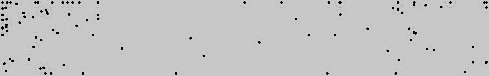
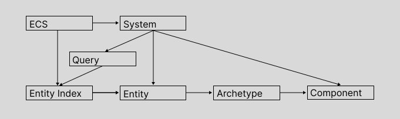

# Swarm — entity component system

[ECS architecture](https://en.wikipedia.org/wiki/Entity_component_system) for exploring emergent behaviour in simulations or game-like systems through composition.

## [Demo 🡥](./demo/index.html)



## Design
- Indexed query results for constant-time lookup
- Bitmask based archetype resolution **limited to 32 components** per ECS instance
- Queries with support for ALL, ANY and NONE selectors
- Simple stage-based system execution ordering
- Typed components API
- OOP-like entity/component interface
- Archetypal architecture but without focus on memory layout/cache locality




```javascript
const ecs = ECS();
const Position = ComponentType<{ x: number, y: number }>();

const entity = ecs.Entity();
entity.addComponent(Position.create({ x: 50, y: 50 }));

ecs.System('movement', Stages.UPDATE, 
  ecs.Query(Position), (entities) => {
    for (const entity of entities) {
      const position = entity.getComponent(Position)?.data;

      if (!position) continue;

      position.x += 1;
      position.y += 1;
    }
  }
);
```


## Basic Usage

### Creating an ECS instance
```javascript
const ecs = ECS();
```

Creating an entity
```javascript
const entity = ecs.Entity();
```

Adding components
```javascript
const Position = ComponentType<{ x: number, y: number }>();
const Velocity = ComponentType<{ velocity: number }>();

entity.addComponent(Position.create({ x: 50, y: 50 }));
entity.addComponent(Velocity.create({ velocity: 0 }));
```

### Creating Systems
```javascript
ecs.System('movement', Stages.PRE_UPDATE, 
  ecs.Query(Position, Velocity), (entities) => {
    for (const entity of entities) {
      const position = entity.getComponent(Position).data;
      const velocity = entity.getComponent(Velocity).data;

      if (!(position && velocity)) { return; }

      position.x += velocity;
      position.y += velocity;
    }
  }
);
```

### Run Systems
```javascript
ecs.run();
```